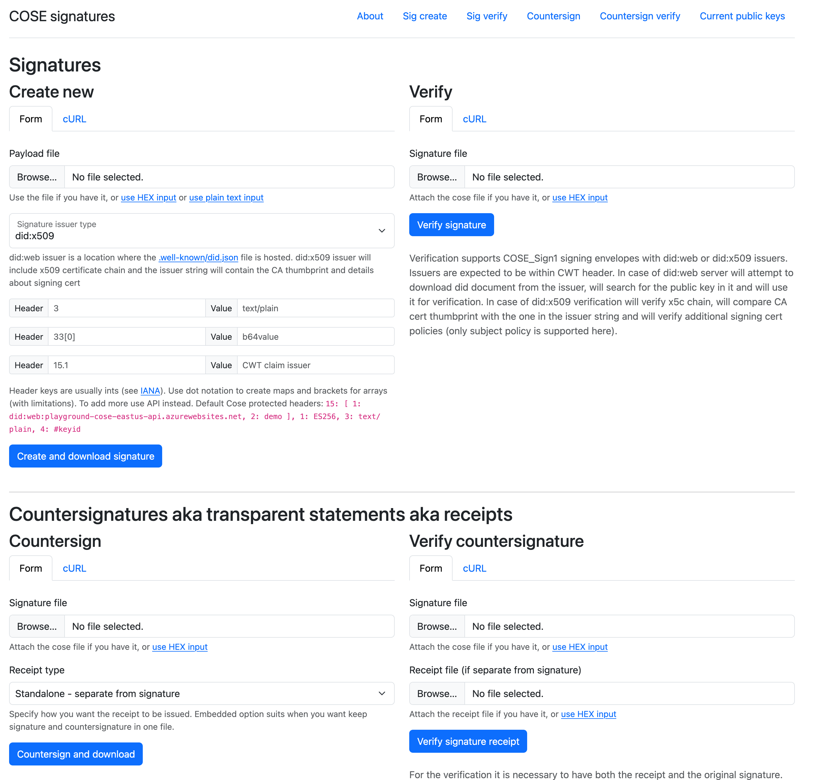

Cose signing and countersigning playground
=================================

API/website: https://playground-cose-eastus-api.azurewebsites.net

# Development

**Prerequisites**

- Install Go to compile and run the application: https://golang.org/doc/install
- Install Node to run e2e tests: https://nodejs.org/en/download/
- Install Azure Functions Core Tools if you will run the local in Azure functions environment: https://learn.microsoft.com/en-us/azure/azure-functions/functions-run-local
- Access to Azure if you will create/update/deploy function app: https://portal.azure.com
  - Azure CLI is used when deploying the [resources](./deployments/)

**Commands**

- Testing
  - Run unit tests: `go test -v ./...`
  - Run functional end-to-end (e2e) tests, [see readme](cypress/README.md)
- Running locally
  - Compile and execute the server binary: `go run .`
  - Or, run the server in an Azure function environment locally: `./scripts/run.sh`
- Deployment
  - Build the binary `GOOS=linux GOARCH=amd64 go build -o bin/server server.go`
  - Compile and deploy to Azure: [azure.fn.deploy.sh](deployments/azure.fn.deploy.sh)
  - Create required Azure infrastructure: [azure.infra.create.sh](deployments/azure.infra.create.sh)

# About

A simple Go application that implements a COSE signing and countersigning. Works as a REST API but also as a basic website with the HTML forms.

It gets deployed as a standalone Azure function app, but can be run locally as well.

## Signatures and countersignatures

Main RFCs used in the playground:
- CBOR Object Signing and Encryption (COSE): Structures and Process https://datatracker.ietf.org/doc/html/rfc9052
- CBOR Object Signing and Encryption (COSE): Countersignatures https://datatracker.ietf.org/doc/html/rfc9338 

SCITT draft defines some expectatins about the COSE signatures which the code uses as well, i.e. CWT header, but this playground does not implement required countersignature format https://www.ietf.org/archive/id/draft-ietf-scitt-architecture-11.html

### Public key distribution

This playground uses `did:web` issuer string and the corresponding public key distribution https://w3c-ccg.github.io/did-method-web/ although signing keys are short lived and are practical for the immediate validation only.

Alternatively you can use `did:x509` issuer which will also have `x5c` chain added, but the suppot is limited, e.g. not all policies will work https://github.com/microsoft/did-x509 .

## Azure functions

- Create a Go function in Azure https://learn.microsoft.com/en-us/azure/azure-functions/create-first-function-vs-code-other
- Install and use Azure functions core tools https://learn.microsoft.com/en-us/azure/azure-functions/functions-run-local
- Wildcard routes in function config https://briandunnington.github.io/azure_functions_wildcard_routing
- Mount a file share in the function (Linux) https://learn.microsoft.com/en-us/azure/azure-functions/scripts/functions-cli-mount-files-storage-linux
- Deploy a function with Azure CLI https://markheath.net/post/deploying-azure-functions-with-azure-cli 